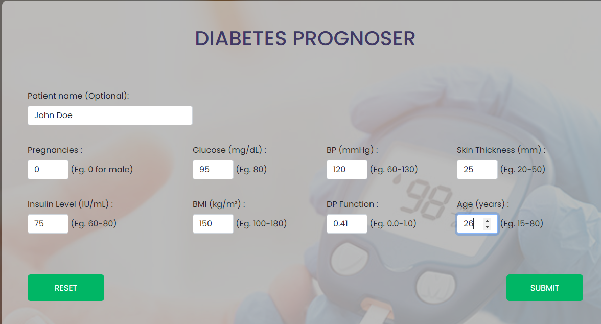
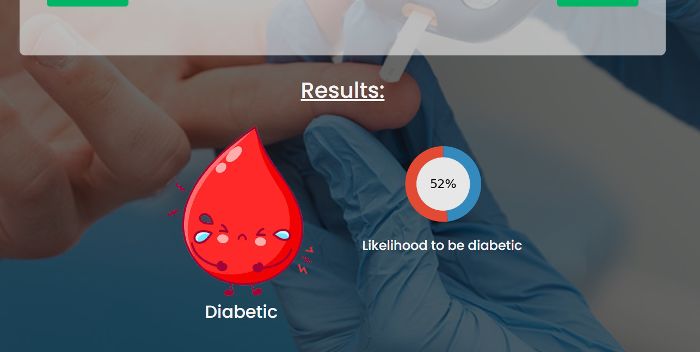

# Diabetes-Case-Predictor
* Overview
* Technical aspect
* Installation

# Overview
Diabetes case predictor is a web app build using machine learning algorithms to predict whether the patient have diabetes or not. Diabetes is a common disease caused by a set of metabolic ailments where the sugar stages over adrawn-out period is high. It touches the diverse organs of the human body’s system, in precise the blood strains and nerves. Early prediction in such a disease can be exact and save human life. However, it is not possible to monitor patients every day in all cases accurately and consultation of a patient for 24 hours by a doctor is not available since it requires more patience, time, and expertise. To achieve the goal, this research work mainly discovers numerous factors associated with this disease using machine learning techniques. The early prognosis of diabetes patients can aid in making decisions on lifestyle changes in high-risk patients and in turn reduce the complications, which can be a great milestone in the field of medicine.

# Technical aspect
This project has been made using the Python3 language and different python frameworks like Numpy, Pandas, Sklearn and so on. The model has been trained using different machine learning alagorithms like Random Forest Classifier. The web app has been made using the Flask and deployed on the server using Heroku.

#Installation
Various packages has been installed on the process. For instance,
* pip install numpy
* pip install sklearn
* pip install matplotlib
* pip intall flask
* pip install gunicorn

